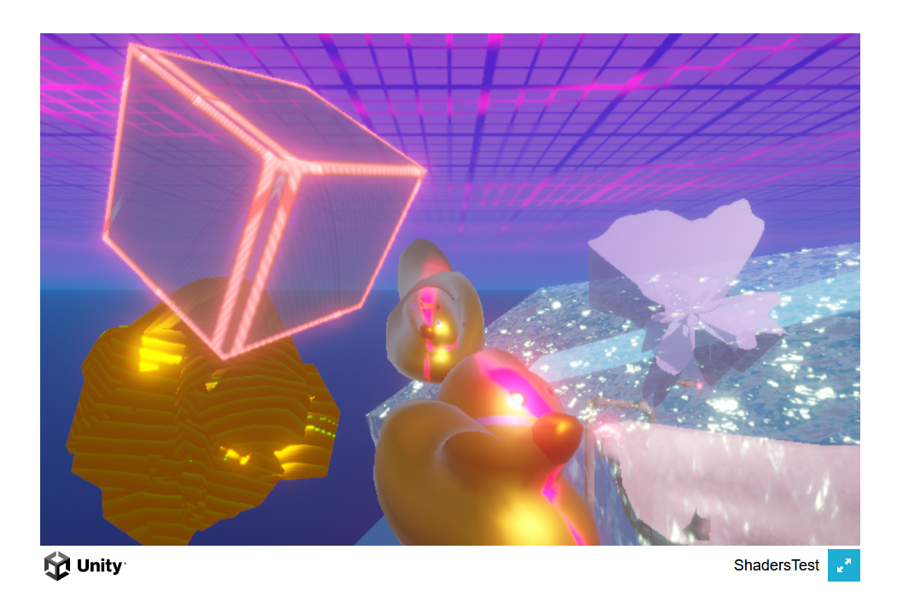

# ShadersTest

shaders test on web

### project version
`Unity 6000.2.3f1 LTS`

## [Patch-Notes game jam submission](https://tablefortwenty.itch.io/buggy-ducky)
*Buggy Ducky*, made by team *TableForTwenty*

## [Github Pages of ShadersTest](https://nebobyeoli.github.io/ShadersTest-webbuild/)

Preview image

 

## Shader graph testing shenanigans

### URP Lit transparent specular type
- *Specular color* slot with Scene Color node determines the "fake alpha" of result by the saturation of specular color
- on web, "fake alpha" by Scene Color + specular in *Fragment Color* slot either gives "completely opaque" or "completely transparent" result
- on web, simulating normals via *Fragment Color* manipulation dealing with opacity doesn't seem to work

- shadows cast by transparent materials doesn't seem to work on web for some reason, and perceived depth may be flattened because of that

### Other

- adding `_` parameters makes the whole shader disappear in web for some reason

- the behavior of *Smoothness* slot seems to be inverted between simulating normals in the *Fragment Color* vs. using the actual *Normal* slot
